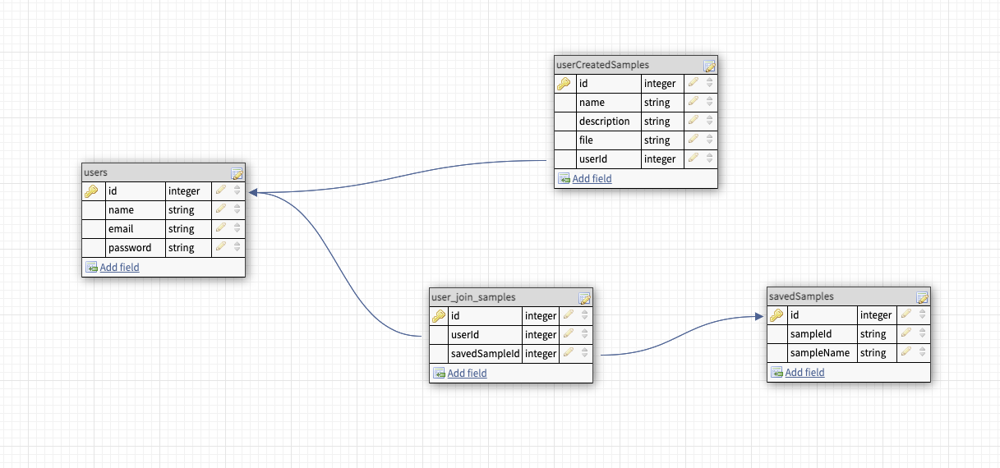

# SampleLandia 

## Deployed Link
https://samplelandia.herokuapp.com/
email: test1@test.com   
password: password

## Objective
    SampleLandia is an application to provide users with audio samples based upon their search requirements and also HOPEFULLY upload their own samples. This application utilizes the freesound.org API.

## ERD

## Routes
    -POST /users (create user)
    -POST /users/login (user login)
    -POST /users/:userId/save/:sampleId
    -POST /samples/userGenerated
    -DELETE /users/:userId/delete/:sampleId
    -POST /samples (get all samples (there will be body info))
    -GET /samples/:sampleId (display one sample)

## User Stories 
    -On load display home screen where you can search for samples
    -Use the search bar to search for samples
    -Clicking sample name will take you to a single sample page where you can hear that sample and download that sample if you choose
    -Have login and signup links at the top of the page
    -Click signup and a form appears to put in name, email, password
    -When logged in you can save samples as favorites to your profile
    -when logged in there is a create tab where you can upload samples of your own
    -when you click on a sample that you uploaded there will be an edit button where you can edit its information 

 ## MVP
    -Login & Signup
    -User Authorization
    -password hashing
    -Be able to search for recipes that align with their diet
    -Save recipes
    -Saved recipes show on their profile
    -Log out 
